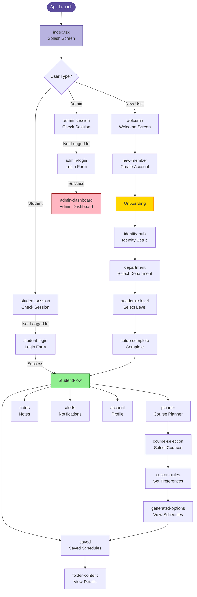
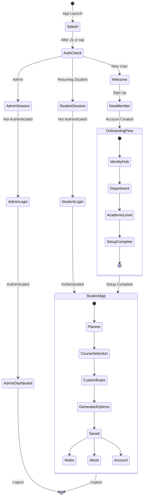

# UniSmart Navigation Flow Diagram



## Route Structure

```mermaid
graph TB
    Root[Root Layout<br/>_layout.tsx] --> Index[index.tsx]
    Root --> AuthGroup[(auth) Group]
    Root --> OnboardingGroup[(onboarding) Group]
    Root --> StudentGroup[(student) Group]
    Root --> AdminGroup[(admin) Group]
    Root --> Modal[modal.tsx]
    
    AuthGroup --> WelcomeRoute[welcome]
    AuthGroup --> StudentSessionRoute[student-session]
    AuthGroup --> StudentLoginRoute[student-login]
    AuthGroup --> AdminSessionRoute[admin-session]
    AuthGroup --> AdminLoginRoute[admin-login]
    AuthGroup --> NewMemberRoute[new-member]
    
    OnboardingGroup --> IdentityHubRoute[identity-hub]
    OnboardingGroup --> DepartmentRoute[department]
    OnboardingGroup --> AcademicLevelRoute[academic-level]
    OnboardingGroup --> SetupCompleteRoute[setup-complete]
    
    StudentGroup --> PlannerRoute[planner]
    StudentGroup --> SavedRoute[saved]
    StudentGroup --> NotesRoute[notes]
    StudentGroup --> AlertsRoute[alerts]
    StudentGroup --> AccountRoute[account]
    StudentGroup --> FolderContentRoute[folder-content]
    StudentGroup --> PlannerFlowGroup[(planner-flow) Group]
    
    PlannerFlowGroup --> CourseSelectionRoute[course-selection]
    PlannerFlowGroup --> CustomRulesRoute[custom-rules]
    PlannerFlowGroup --> GeneratedOptionsRoute[generated-options]
    
    AdminGroup --> AdminDashboardRoute[admin-dashboard]
    
    style Root fill:#5B4C9D,stroke:#fff,color:#fff
    style AuthGroup fill:#FF6B6B,stroke:#8B0000
    style OnboardingGroup fill:#FFD700,stroke:#FF8C00
    style StudentGroup fill:#90EE90,stroke:#006400
    style AdminGroup fill:#FFB6C1,stroke:#8B0000
    style PlannerFlowGroup fill:#87CEEB,stroke:#006400
```

## User Journey Flow




